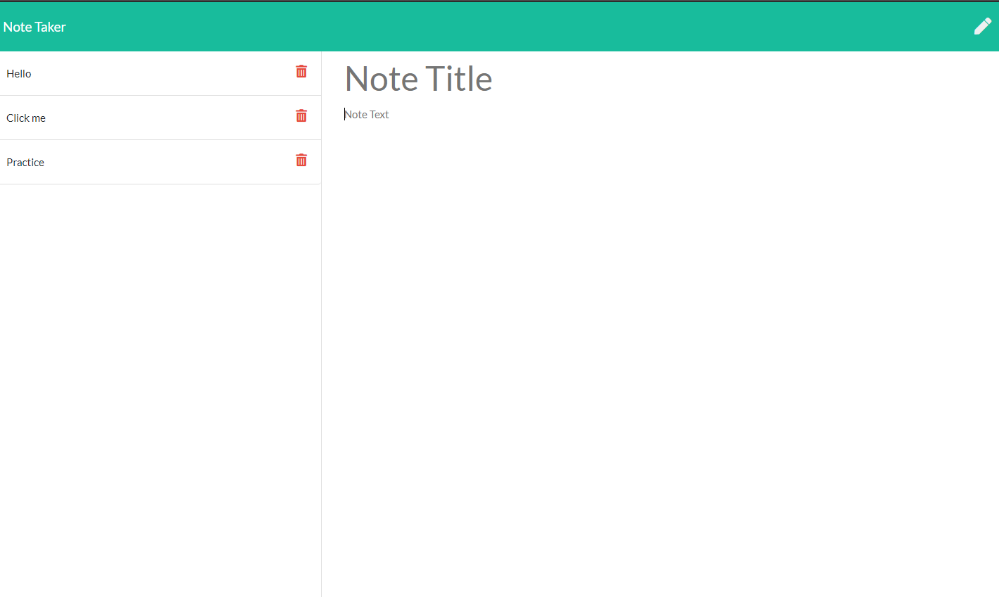

# noteTaker

  [github](https://github.com/devonp702/noteTaker)

  [heroku](https://notepalace.herokuapp.com/)

  

  ## Table of Contents
* [Introduction](#introduction)
* [Installation](#installation)
* [Usage](#usage)
* [License](#license)
* [Contributing](#contributing)
* [Tests](#tests)
* [Questions](#questions)

  ## Introduction
  Make notes and read them using an Express server.

  ## Installation
  This program runs in the browser. You can also install it and run it on localhost:3000)

  ## Usage
  Click the pencil to create a new note, click the save icon to save. The trash can can be used to delete items.
  ## License
  
  * I am using the MIT license. 
  
  
  ## Contributing
  This Code of Conduct is adapted from the [Contributor Covenant][homepage],
  version 2.0, available at
  https://www.contributor-covenant.org/version/2/0/code_of_conduct.html.
  ## Tests
  There are no tests yet.
  ## Questions
  Thanks for taking the time to look at my project.
  If you would like to ask me any questions, please contact me.
  * On Github, User Name : devonp702
  * eMail me: devon.p702@gmail.com
